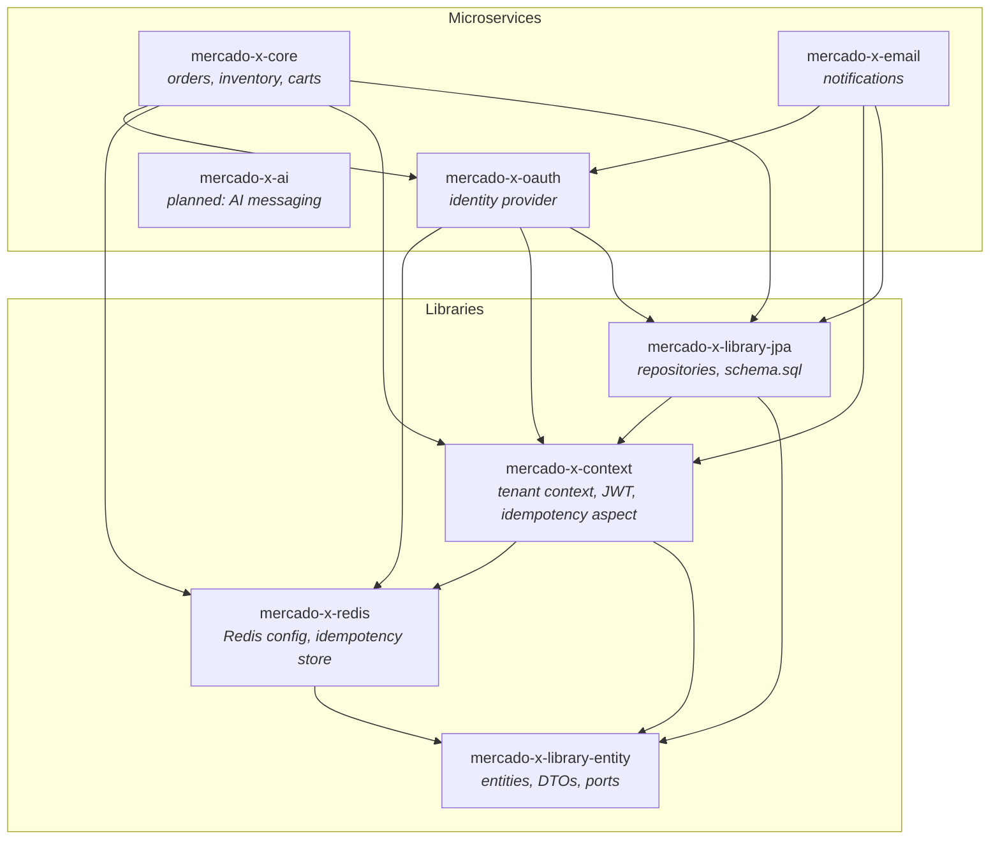
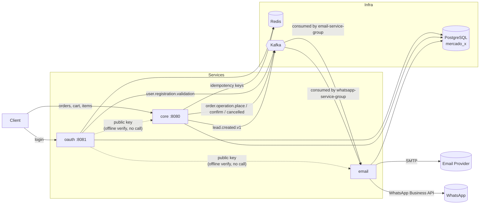

# MercadoX Parent

## Overview

`mercado-x-parent` is the root Maven parent project for the MercadoX ecosystem.

Its sole responsibility is to:

- Provide a centralized `pom.xml`
- Manage dependency versions
- Define shared plugins and configurations
- Declare the ecosystem modules
- Enforce consistent build standards

This project does **not** contain application code.

---

## Responsibilities

- Dependency Management (Spring Boot, Hibernate, QueryDSL, Kafka, etc.)
- Plugin Management (Maven Compiler, Surefire, Failsafe, etc.)
- Shared properties (Java version, encoding, etc.)
- Module aggregation

---

## Modules

The following modules compose the MercadoX ecosystem:

- mercado-x-library-entity
- mercado-x-library-jpa
- mercado-x-context
- mercado-x-oauth
- mercado-x-core
- mercado-x-email

---

## Purpose

To guarantee:

- Version consistency across services
- Standardized builds
- Maintainable multi-module architecture
- Clean separation of concerns

---

## Ecosystem Architecture

MercadoX is split into two kinds of modules: **libraries** (compiled JARs, no `main()`, shared via GitHub Packages) and **microservices** (deployable Spring Boot apps). Libraries carry no business logic of their own — they exist so the entities, tenant/context propagation, and Kafka/Redis plumbing aren't reimplemented per service.

### Build-time dependency graph

`mercado-x-core` and `mercado-x-email` depend on `mercado-x-oauth` at compile time only for its JWT verification filter chain — neither calls it over the network at request time (see below).

### Runtime communication

Key points this diagram makes explicit:

- **oauth is the only service holding the JWT private key.** `core` and `email` verify tokens locally against the public key — no token-introspection round trip per request.
- **Kafka decouples core from email.** `core` never calls `email` directly; it publishes domain events (`ORDER_PLACING`, `ORDER_CONFIRMED`, `ORDER_CANCELLED`, `LEAD_CREATED`) and `email`'s two consumer groups (`email-service-group`, `whatsapp-service-group`) react independently. A slow/down email service doesn't block order placement.
- **Redis is shared but used differently per service** — `core` uses it for the `@IdempotentOperation` dedupe pattern; `oauth` uses it for its own session/token concerns.
- **`mercado-x-ai`** is scaffolded but not yet wired into this graph — it's the next planned consumer (see each service's README for module-specific detail).